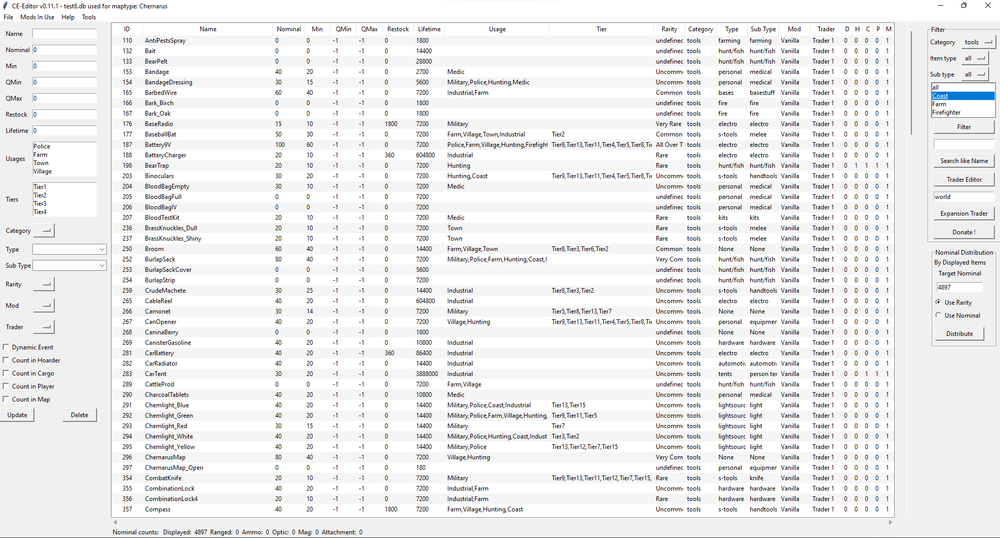
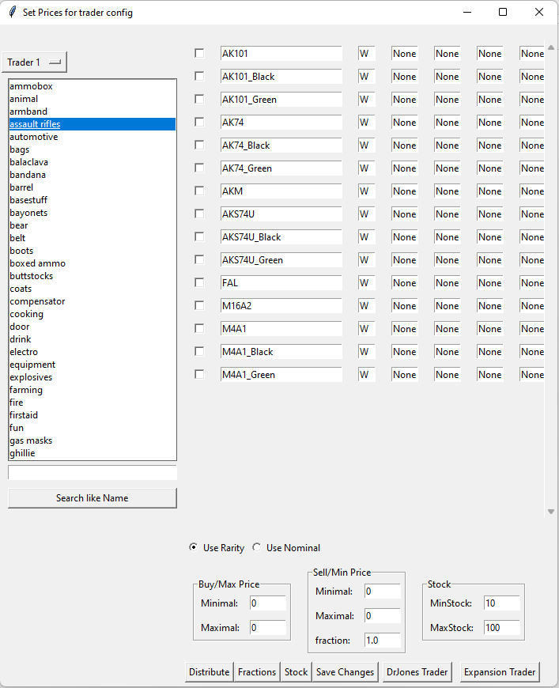

# Dayz Loot DataBase
A Database solution to manage the Loot distribution for multiple mods in one database solution. 

DayZ Loot DataBase for types.xml.
This solution helps with ordering and balancing the editing of Loot when you have more mods on the server.
It is possible to have a good central over view of the different mods and also do distribute the loot accross the different Mods, Tiers and categories

It also has some Automatic functions for Loot distribution

- Visualize loot as a list from database
- Automatically creates Types and Sub-types for items
- Derive the rarity of a item base in the imported Nominal value
- Change registrations for 1 or more items
- Easily edit Loot Manually thanks to types and subtypes
- Automatically generate distributions based on Rarity or nominal
- Create trader categories with automatic price distribution ready formated to paste into trader config
- Export back to types.xml

![main window]

Built upon a SQLite database that will be automatically generated.

## Install
1. Now download the zip-file
1. Unpack
1. Run the `DayZ_LootEditor.exe`

## First Startup
On startup, you will see the defaul Charnarus.db loaded
This is based on the vanilla loot from the Chernarus map with default assigned:
- Rarity
- Types
- Subtypes

If you want to start your own data base click File - Setup database
 

## Features
### Filtering Shown Items
In the top right corner, there are 3 drop-down's that can be used to filter the view based on

* Category
* Items
* Sub types  

Enter a keyword in the Name entry top left and press the filter by name button.

### Editing Items
1. Select an item or multiple by clicking shift or ctrl
2. change the Values you want
3. Click Update

### Export types.xml
1. In the menubar click file > export types.xml or click file > export Namalsk types.xml
The application can save types.xml file for both normal maps and for the Namalsk variant

### Adding New Items
Paste new Items or Items that changed Values  
Go to File > Add Items...  

1. Paste in all new items you want to add
2. Enter the Name of the mod the new Items belong to
3. If the item already exists in the Database but you want the values of the pasted item to be used, check "Use Value of Duplicate Item" and it will change the value of the item in the Database to the value of the pasted Item.
4. click OK

### Trader Editor

On the left you see all sub types in the database, you can create new ones by changeing the subtypes of items.
On the right all items with the selected subtype are listed.  
If the Checkbox to the left of each item name is checked, the item will be exclude and will not appear in the generated trader category.  This will not delete the item from the database.  
  
By setting "Use Rarity" or "Use Nominal" you can set how the pricing will be distributed. Only use rarity if you have set the rarity of all items of that sub type.

First click Distribute Pricing.  
Then Update Changes and Copy to Clipboard.
If you forget to Save Changes, your progress will be lost.
Paste the copied content into your trader file.

### Mod Selector
Ticking mod names in the "Mods in use" menu will remove the items from that mod.
Items that are in a mod that has been unticked will not export in the types.xml.
The Items will not be deleted they're just hidden.
If you add your items to the "removed" mods, then they will automatically be hidden on every startup  
  

### Setting Rarity
Nine Rarity types, if this is too many for you just use every second one.
The Rarity types have multipliers assigned to them:
#### Multipliers

| Rarity             | Multiplier |
| ------------------ | ---------- |
| undefined          | NaN        | 
| Legendary          | 1          | 
| Extremely Rare     | 1.5        | 
| Very Rare          | 2          | 
| Rare               | 2.5        | 
| Somewhat Rare      | 3          |
| Uncommon           | 5          | 
| Common             | 8          | 
| Very Common        | 12         | 
| All Over The Place | 20         | 

### Nominal Distribution
The Nominal Distribution section is used to balance the loot on the server

It shows the sum of the currently selected Items and can be re-adjusted relative to nominal, or based on the rarity that is assigned to the items
Items with Nominal value of 0 are excluded from the distribution
### Nominal counts

this shows overall nominal added up for all gun, mags... So you can check if you overall increased or decreased the loot count

